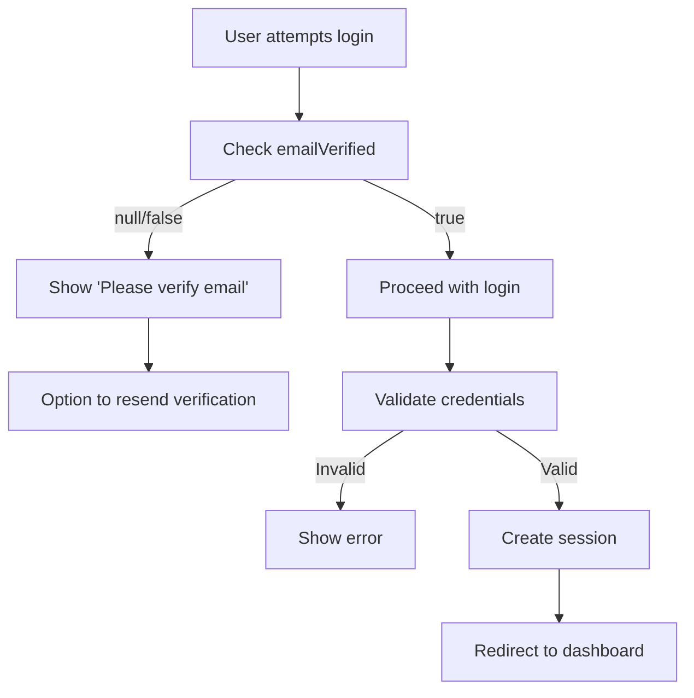

# VPS Rental - Authentication System Guide

Hệ thống xác thực hoàn chỉnh bao gồm đăng ký, xác minh email và reset password đã được triển khai thành công!

## 🔧 Cấu hình cần thiết

### 1. Resend API Key

Bạn cần đăng ký tài khoản tại [Resend](https://resend.com) và lấy API key:

1. Truy cập <https://resend.com> và đăng ký tài khoản
2. Xác minh email và đăng nhập
3. Vào **API Keys** tạo key mới
4. Copy API key và cập nhật trong file `.env`:

```env
RESEND_API_KEY="re_xxxxxxxxxx"
```

### 2. From Email Domain

Cấu hình domain gửi email:

```env
FROM_EMAIL="Your Company <noreply@yourdomain.com>"
```

**Lưu ý:** Với Resend free plan, bạn có thể sử dụng domain mặc định hoặc verify domain riêng để gửi được tới nhiều email khác.

## 🔐 Authentication Implementation với Auth.js & Prisma PostgreSQL

### Overview

Hệ thống authentication được xây dựng trên nền tảng:

- **Auth.js (NextAuth.js v5)**: Modern authentication framework
- **Prisma ORM**: Type-safe database access
- **PostgreSQL**: Production-ready database
- **Custom Credentials Provider**: Email/password authentication
- **Social Providers**: Google, GitHub OAuth

### 1. Prisma Database Schema

**Location**: `prisma/schema.prisma`

### 2. Auth.js Configuration

**Location**: `lib/auth.ts`

### 3. Database Utilities

**Location**: `lib/prisma.ts` & `utils/auth.ts`

### 4. Validation Schemas

**Location**: `lib/schema.ts`

### 5. API Routes với Auth.js Integration

**Location**: `app/api/auth/[...nextauth]/route.ts` & `app/api/credential/register/route.ts`

### 6. Client-side Auth Hooks

**Location**: `hooks/useAuth.ts`

### 7. Middleware Protection

**Location**: `middleware.ts`

✅ Automatic redirect cho protected pages  
✅ Remember intended destination  
✅ Graceful unauthorized access handling

### 8. Environment Variables

**Location**: `.env`

### 9. Session Provider Setup

**Location**: `app/[locale]/layout.tsx`

## 🎨 Email Templates

Hệ thống sử dụng React Email với 2 templates chính:

### 1. Email Verification Template

- ✅ Hướng dẫn rõ ràng
- ✅ Expiry warning (24 giờ)
- ✅ Logo và branding

**Location**: `components/custom/email/EmailVerification.tsx`

### 2. Password Reset Template  

- ✅ Expiry warning (1 giờ)
- ✅ Hướng dẫn bảo mật rõ ràng
- ✅ Professional layout

**Location**: `components/custom/email/EmailResetPassword.tsx`

## 🔐 Security Features

Hệ thống bao gồm các tính năng bảo mật cao cấp:

### Authentication Security

1. **Password Hashing**: Bcrypt với salt rounds = 12
2. **Input Validation**: Zod validation cho tất cả input
3. **Email Verification**: Bắt buộc verify email trước khi login
4. **Error Handling**: Chi tiết lỗi được xử lý an toàn

### Token Security

1. **UUID v4**: Tokens được generate securely
2. **Single Use**: Mỗi token chỉ sử dụng được 1 lần
3. **Time Expiry**:
   - Email verification: 24 giờ
   - Password reset: 1 giờ
4. **Automatic Cleanup**: Tokens hết hạn được tự động xóa

## 📧 Complete Authentication Flows

### 🔑 1. Registration & Email Verification Flow

**Chi tiết các bước:**

1. **User Registration**
   - Nhập form: name, email, password, phone
   - Password strength indicator

2. **Server Processing**
   - Zod schema validation
   - Check duplicate email
   - Hash password với bcrypt
   - Create user với `emailVerified: null`

3. **Token Generation**
   - Generate UUID v4 token
   - Set expiry: 24 hours
   - Save vào `VerificationToken` table

4. **Email Sending**
   - Send via Resend API

5. **Email Verification**
   - User clicks link trong email
   - Page auto-redirect tới API endpoint
   - API validates token và updates user
   - Cleanup token sau khi thành công

### 🔓 2. Password Reset Flow

**Chi tiết các bước:**

1. **Forgot Password Request**
   - User vào `/forgot-password`
   - Nhập email address
   - System tìm user (không reveal nếu email không tồn tại)

2. **Reset Token Generation**
   - Generate UUID v4 token
   - Set expiry: 1 hour
   - Delete existing reset tokens cho user
   - Save token mới

3. **Reset Email**
   - Send email với red security theme
   - Include reset URL với token & email params
   - Clear security warnings về expiry

4. **Password Reset**
   - User clicks link → redirect tới `/reset-password`
   - Auto-validate token on page load
   - Show appropriate states: loading, invalid, valid
   - Form với password confirmation

5. **Password Update**
   - Validate new password
   - Hash với bcrypt
   - Update user record
   - Delete reset token
   - Show success confirmation

### 🔐 3. Login Flow Integration



## 🧪 Testing Guide

### Test Registration Flow

```bash
# 1. Register new user
curl -X POST http://localhost:3000/api/credential/register \\
  -H "Content-Type: application/json" \\
  -d '{
    "name": "Test User",
    "email": "test@example.com", 
    "password": "TestPass123",
    "phone": "0123456789"
  }'

# 2. Check email for verification link
# 3. Click link hoặc manual verification:

curl -X POST http://localhost:3000/api/credential/verify-email \\
  -H "Content-Type: application/json" \\
  -d '{
    "token": "your-uuid-token",
    "email": "test@example.com"
  }'
```

### Test Password Reset Flow

```bash
# 1. Request password reset
curl -X POST http://localhost:3000/api/credential/forgot-password \\
  -H "Content-Type: application/json" \\
  -d '{
    "email": "test@example.com"
  }'

# 2. Check email for reset link
# 3. Use token to reset password:

curl -X POST http://localhost:3000/api/credential/reset-password \\
  -H "Content-Type: application/json" \\
  -d '{
    "token": "your-reset-token",
    "email": "test@example.com",
    "password": "NewPassword123",
    "confirmPassword": "NewPassword123"
  }'
```

## 📱 UI Components & Pages

### 1. Registration Page (`/register`)

- ✅ Multi-step form với validation
- ✅ Password strength indicator  
- ✅ Loading states và error handling
- ✅ Success state với email confirmation
- ✅ Newsletter subscription checkbox
- ✅ Links tới login page

### 2. Email Verification Pages

- ✅ **`/verify-email`**: Auto-redirect page
- ✅ **API redirect**: Handles verification logic
- ✅ **Success page**: Confirmation và login link
- ✅ **Error handling**: Invalid/expired tokens

### 3. Forgot Password Page (`/forgot-password`)

- ✅ Clean email input form
- ✅ Success state với instructions
- ✅ Security messaging
- ✅ Back to login link
- ✅ Option to resend email

### 4. Reset Password Page (`/reset-password`)

- ✅ **Token validation**: Auto-check on load
- ✅ **Loading state**: During token validation  
- ✅ **Invalid token state**: Clear error message
- ✅ **Reset form**: Password confirmation
- ✅ **Success state**: Confirmation và login link
- ✅ **Password requirements**: Visual guidelines

### 5. Login Page (`/login`)  

- ✅ **Forgot password link**: Direct integration
- ✅ **Email verification checks**: Block unverified users
- ✅ **Error handling**: Detailed feedback
- ✅ **Remember me**: Persistent sessions

## 🚀 Production Checklist

### Email Configuration

- [ ] **Resend Domain**: Verify domain ownership
- [ ] **FROM_EMAIL**: Set proper sender name
- [ ] **DNS Records**: SPF, DKIM configuration  
- [ ] **Email Templates**: Test rendering across clients
- [ ] **Delivery Testing**: Test to major email providers

### Security Hardening

- [ ] **Rate Limiting**: Implement per-IP limits
- [ ] **CSRF Protection**: Enable for state-changing operations
- [ ] **Input Sanitization**: HTML escaping
- [ ] **SQL Injection**: Use parameterized queries
- [ ] **Token Storage**: Secure token generation

### Environment Setup

- [ ] **NEXTAUTH_URL**: Update for production domain
- [ ] **DATABASE_URL**: Production database connection
- [ ] **Secret Keys**: Generate strong secrets
- [ ] **HTTPS**: Force SSL in production
- [ ] **Monitoring**: Error tracking và logging

### Performance

- [ ] **Database Indexing**: Email, token columns
- [ ] **Connection Pooling**: Database connections
- [ ] **Caching**: Session and user data
- [ ] **Email Queue**: Async email processing
- [ ] **Rate Limiting**: API endpoint protection

## 📚 API Documentation

### Authentication Endpoints

**POST /api/credential/register**

```typescript
// Request
{
  name: string;
  email: string;
  password: string;
  phone?: string;
}

// Response
{
  success: boolean;
  message: string;
  data: {
    user: {
      id: string;
      email: string;
      name: string;
      emailVerified: null;
    }
  }
}
```

**POST /api/credential/verify-email**

```typescript
// Request
{
  token: string;
  email: string;
}

// Response  
{
  success: boolean;
  message: string;
  data: {
    user: {
      id: string;
      email: string;
      emailVerified: Date;
    }
  }
}
```

**POST /api/credential/forgot-password**

```typescript
// Request
{
  email: string;
}

// Response (always success for security)
{
  success: true;
  message: string;
}
```

**POST /api/credential/reset-password**

```typescript
// Request
{
  token: string;
  email: string;
  password: string;
  confirmPassword: string;
}

// Response
{
  success: boolean;
  message: string;
  user?: {
    id: string;
    email: string;
  }
}
```

**GET /api/credential/reset-password?token=xxx&email=xxx**

```typescript
// Response
{
  success: boolean;
  message: string;
  user?: {
    id: string;
    email: string;
  },
  tokenExpiry?: Date;
}
```

### React Hooks Usage

```typescript
// useAuth Hook
const { 
  register, 
  forgotPassword, 
  resetPassword, 
  validateResetToken 
} = useAuth();

// Registration
const result = await register({
  name: 'John Doe',
  email: 'john@example.com', 
  password: 'SecurePass123',
  phone: '0123456789'
});

// Forgot Password
const result = await forgotPassword('john@example.com');

// Reset Password  
const result = await resetPassword(
  'reset-token', 
  'john@example.com',
  'NewPassword123',
  'NewPassword123'
);

// Validate Reset Token
const result = await validateResetToken('reset-token', 'john@example.com');
```

## 🐛 Troubleshooting Guide

### Email Delivery Issues

**Problem**: Email không được gửi

```bash
# Check logs
console.log('Resend API Response:', data);

# Solutions
1. Kiểm tra RESEND_API_KEY trong .env
2. Verify domain trong Resend dashboard  
3. Check FROM_EMAIL format: "Name <email@domain.com>"
4. Test với Resend sandbox environment
5. Monitor Resend dashboard cho delivery status
```

**Problem**: Email vào spam folder

```bash
# Solutions  
1. Verify domain ownership với DNS records
2. Set up SPF, DKIM records
3. Use professional FROM_EMAIL address
4. Avoid spam trigger words trong subject/content
5. Monitor reputation trong Resend analytics
```

### Token Validation Errors

**Problem**: "Token không hợp lệ"

```bash
# Debug steps
1. Check token format (UUID v4)
2. Verify email parameter matches exactly
3. Check token expiry trong database
4. Ensure token hasn't been used already
5. Look for database constraint errors
```

**Problem**: "Token đã hết hạn"  

```bash
# Solutions
1. Generate new verification email
2. Check system time synchronization
3. Verify expiry calculation logic
4. Consider extending expiry time for testing
```

### Database Connection Issues

**Problem**: Prisma connection errors

```bash
# Solutions
1. Run: npm run db:push
2. Check DATABASE_URL format
3. Verify database server is running
4. Generate Prisma client: npx prisma generate
5. Check database schema migrations
```

### Component Rendering Issues

**Problem**: React Email templates không render

```bash
# Debug steps  
1. Check import paths cho email components
2. Verify Tailwind CSS classes
3. Test template với React Email dev tools
4. Check for TypeScript compilation errors
```

---

## 🎉 System Overview

**Authentication system hoàn chỉnh đã sẵn sàng với:**

✅ **User Registration** với email verification bắt buộc  
✅ **Email Verification** với secure tokens và expiry  
✅ **Password Reset** với one-time secure tokens  
✅ **Professional Email Templates** với security focus  
✅ **Comprehensive Error Handling** cho mọi edge cases  
✅ **Security Best Practices** implemented throughout  
✅ **Responsive UI** cho mọi authentication flows  
✅ **Production Ready** với full configuration guide  

Bạn có thể bắt đầu test toàn bộ authentication flow ngay bây giờ!

```typescript
{
  fullName: string;
  email: string;
  password: string;
  phone?: string;
}
```

**POST /api/credential/verify-email**

```typescript
{
  token: string;
  email: string;
}
```

**GET /api/credential/verify-email?token=xxx&email=xxx**

- Redirect endpoint for email links

### React Hooks

```typescript
const { register, verifyEmail } = useAuth();

// Registration
const result = await register({
  fullName: 'John Doe',
  email: 'john@example.com', 
  password: 'SecurePass123',
  phone: '0123456789'
});

// Email verification
const result = await verifyEmail(token, email);
```

---

🎉 **Authentication system hoàn chỉnh đã sẵn sàng!**

**Hệ thống bao gồm:**

- ✅ User Registration với email verification
- ✅ Password Reset với secure tokens  
- ✅ Professional email templates
- ✅ Complete UI flows
- ✅ Security best practices
- ✅ Production ready configuration

Bạn có thể bắt đầu test toàn bộ authentication flow ngay bây giờ!
